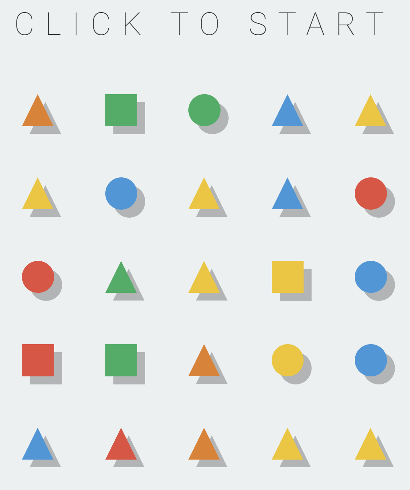

# Shapes
Little game based on shapes with HTML, JS and CSS.

[PLAY!](https://blondie-themanwithnoname.github.io/Shapes/)

## Game Idea

The goal is to change the color of every shape to the same one by hoverin on the shapes. Then when you left-mouse click the shapes you hovered won't change color and the ones you didn't hover will.

